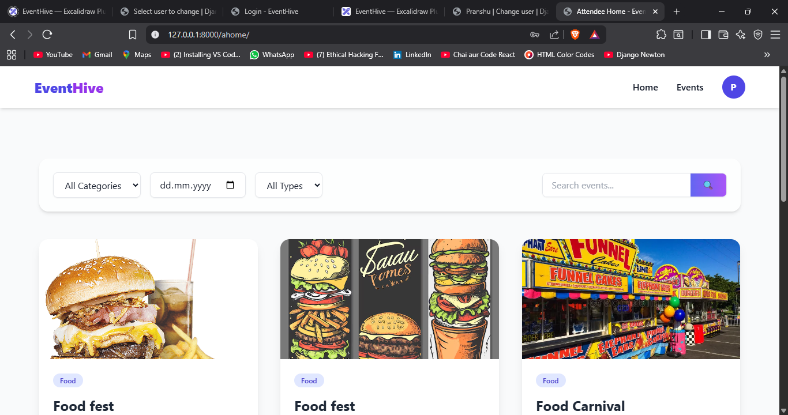

# 🎉 EventHive  

EventHive is a modern **event management platform** that helps users create, discover, and manage events seamlessly.  
Whether it’s a **workshop, seminar, or community meetup**, EventHive provides an intuitive interface for both **organizers** and **attendees**.  

---

## 🚀 Features  

- 🔐 **User Authentication** – Secure signup/login for attendees & organizers  
- 📝 **Event Creation** – Add events with descriptions, images & schedules  
- 🔍 **Event Discovery** – Browse & search events by category, location, or date  
- 🎟 **Ticket Booking** – Book & manage tickets online  
- ⚙️ **Admin Panel** – Manage users, events, and registrations  
- 📱 **Responsive UI** – Mobile-friendly design for better accessibility  
- 🖼 **Media Support** – Upload event posters, banners, and related files  

---

## 🛠 Tech Stack  

- **Backend:** Django (Python)  
- **Frontend:** HTML, CSS, JavaScript (with Bootstrap/Tailwind CSS)  
- **Database:** SQLite (development) / PostgreSQL (production)  
- **Template Engine:** Django Templates  
- **Tools & Utilities:** Git, Virtualenv  

---

## 🎮 Usage  

👩‍💼 **Organizers** → Create and manage events, upload banners, track registrations.  
🙋 **Attendees** → Browse events, register, and manage tickets.  
👨‍💻 **Admins** → Manage users, events, and platform settings via the Django Admin Panel.  

---

## 📸 Screenshots  

Homepage Preview:  

  

---

## 🎬 Demo Video  

Watch the full EventHive demo here: [Demo Video Link](https://drive.google.com/your-drive-link)  

> Make sure your Google Drive link has **“Anyone with the link can view”** permissions.  

---

## ⚡ Getting Started  

### 1️⃣ Clone the repository  
```bash
git clone https://github.com/GodaniShubham/EventHive.git
cd EventHive
